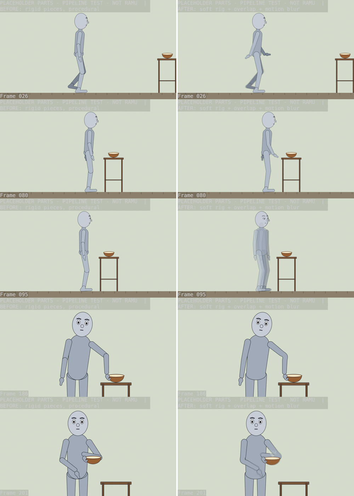
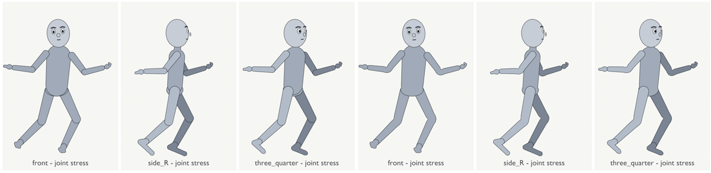
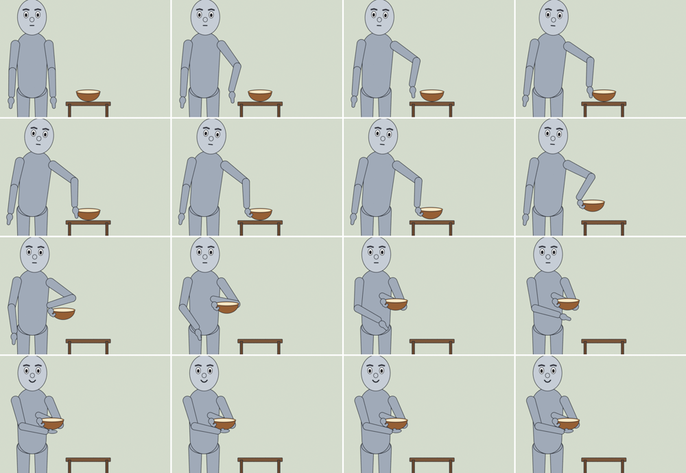

# Ramu Blender pilot: test report

**Date:** 2026-10-03 · **Prepared by:** Claude (cloud session) · **For:**
the NanuYT team, Codex/ChatGPT, and anyone continuing this work

> **Read this first.** Everything below was tested with a **grey placeholder
> mannequin, not Ramu**. Every frame is stamped "PLACEHOLDER … NOT RAMU".
> Ramu's approved art has not been cut into rig layers yet, so nothing here
> shows what Ramu will look like. It shows that the pipeline works and how
> the motion behaves.

## 1. Where everything is

| What | Location |
|---|---|
| Whole pilot folder (code, docs, media) | https://github.com/joyarnold16/joy.arnold16/tree/claude/blender-ramu-pilot-02ff4e/blender_ramu_pilot |
| This report | `blender_ramu_pilot/PILOT_REPORT.md` |
| Agent briefing (rules, commands, decisions), read automatically by Codex | `blender_ramu_pilot/AGENTS.md` |
| How to use the pipeline | `blender_ramu_pilot/README.md` |
| How to prepare Ramu's art for the rig | `blender_ramu_pilot/ART_PREP.md` |
| Text to paste into `00_ADMIN\AI_SYNC_STATUS.md` | `blender_ramu_pilot/AI_SYNC_STATUS_entry.md` |
| Videos and stills | `blender_ramu_pilot/media/` |
| Pull request (draft, for review only; not to be merged into the game repo) | https://github.com/joyarnold16/joy.arnold16/pull/3 |

The folder is meant to be copied into an isolated pilot folder in NanuYT
(e.g. `NanuYT\PILOTS\blender_ramu`). Nothing in NanuYT was changed: no
ComfyUI workflows, models, voices, production settings, EP07 or Shorts.

## 2. Decisions so far

| Decision | By | Notes |
|---|---|---|
| Use a **2.5D cutout rig** (Ramu's approved drawings, cut into layers and moved by bones) | User | Keeps Ramu exactly on-model; turns are swaps between drawn views |
| **Blender does body motion only** | User | ComfyUI does the voice, audio and the other supporting work. Renders are silent |
| **Lip-sync route open** | — | (a) ComfyUI lip-syncs the rendered video. This is untested on a flat 2D face, so test one speaking shot early. (b) Blender swaps drawn mouth shapes from a WAV; this already works |
| **2D vs 3D still open** | — | 3D needs a 3D Ramu that matches the approved art. Proposed: a one-day likeness test in ComfyUI before committing (§7) |
| Blender is the tool (no other animation software) | Claude | Fully scriptable without the interface, so agents can run and verify it. Extra free tools: Rhubarb (optional lip-sync), ffmpeg |

## 3. What the test shot does (10 s, 24 fps, 240 frames)

| Frames | Action |
|---|---|
| 0–8 | Stands (side view); leans back slightly before stepping off |
| 8–80 | Walks 6 steps, heel-toe roll, arms swing |
| 80–92 | Stops; body and arms settle forward, then back |
| 86–100 | Turns: side → 3/4 (frame 96) → front (frame 100), with a dip and a blink |
| 112–164 | Speaks a short line (test audio only; the final route is ComfyUI) |
| 162–186 | Head looks at the bowl, weight shifts, body leans; the left hand comes down onto the bowl's near rim from above |
| 188–204 | Lifts the bowl to chest height, keeping it level |
| 194–212 | The right hand comes up under the bowl's base (two-hand hold) |
| 210–239 | Holds the bowl, smiles, blinks |

## 4. Results (measured from Blender's own scene data, not from intent)

Both versions pass all 10 automatic checks:
- **"Before":** rigid pieces, plain procedural motion.
- **"After":** soft-bending limbs, springs, leads and motion blur.

| Check | Before | After |
|---|---|---|
| Foot sliding while planted (810 frame pairs) | 0.00 px | 0.00 px |
| Feet below the ground line | 0.00 px | 0.00 px |
| Left hand on bowl rim: gap at grip / max after | 0.001 / 0.001 px | 0.000 / 0.000 px |
| Right hand under bowl base: max gap | 0.001 px | 0.001 px |
| Bowl moved before grip / bowl tilt while carried | 0 px / 0° | 0 px / 0° |
| Hand below the tabletop while at the bowl | 0 px | 0 px |
| Frames with a wrong or doubled mouth/eye/brow/hand drawing | 0 | 0 |
| Blinks | 4 | 4 |
| Pops (sudden velocity kinks or jumps) | 0 | 0 |
| Turn swaps: feet / head-top shift | 0 / ≤1.4 px | 0 / ≤1.3 px |

The automated checks find mechanical faults. They do **not** judge appeal or
acting, and a human must watch every render. Proof: the first bowl grip
passed every check and was still physically impossible (§5).

**Render time and memory: cloud CPU only, not your PC.**

| Render | Time per frame | Peak RAM |
|---|---|---|
| Before: Cycles, 960×540, 16 samples | 0.89 s | 398 MB |
| After: Cycles, 960×540, 32 samples + motion blur | 2.34 s | 427 MB |
| Earlier: Cycles, 1920×1080, 16 samples | 3.45 s | 522 MB |

The target engine is EEVEE on the PC's graphics card. Real numbers come from
running `.\run_pilot.ps1 selftest` on the PC with ComfyUI idle.

## 5. What was fixed after review

**Bowl pickup.**
- **Problem.** The first version held the bowl palm-up from underneath while
  it sat on the table, which puts the fingers through the tabletop. QA passed
  it because it only checked that the hand reached its target point.
- **Fix.**
  - The bowl now has named contact points (rim left, rim right, base).
  - The left hand comes down onto the near rim from above, lifts, and the
    right hand then supports the base.
  - The table is now a realistic 0.78 units high, at near-full arm's reach,
    which also removed an awkward high "chicken wing" elbow.
- **New check, `hand_vs_table`.** It looks at the visible hand drawings
  while the hand is at the bowl. The old grip measured 48.8 px through the
  table (FAIL); the new one is 0 px.

**Smoothness (before → after).**
- **Soft rig.** Arms, legs and body are single drawings that bend smoothly
  at the elbow, knee and waist, instead of hinging pieces.
- **Overlap and follow-through.** Head, arms and hands lag and settle,
  driven by the body's real acceleration. Hands holding the bowl are
  excluded, so contacts stay exact.
- **Leads.** He leans back before the first step; the head looks and the
  body leans before the arm reaches; weight shifts first.
- **Speed curves.** Reaches start quickly and land gently; lifts start
  slowly. The first attempt started reaches 2–3× more abruptly than the
  baseline (measured), and was tuned down.
- **Turn.** A 2-frame cross-dissolve between drawings.
- **Motion blur** on fast moves.

**Bugs caught by the checks along the way:**
- the bowl drifting before the grip
- an elbow velocity kink on every arm swing
- an over-strict table check that failed a hand merely hanging beside the
  table


*Left: before. Right: after. Frames 26 (walk), 80 (stop), 95 (turn), 186 (grip), 201 (two-hand catch).*


*The same joint stress poses: rigid pieces (left three) vs soft rig (right three).*


*Revised pickup, frames 172–239.*

Videos (no audio):
- [`media/before_vs_after_PLACEHOLDER.mp4`](media/before_vs_after_PLACEHOLDER.mp4)
- [`media/bowl_pickup_PLACEHOLDER.mp4`](media/bowl_pickup_PLACEHOLDER.mp4)

## 6. Known issues (honest list)

1. **Turn cross-dissolve "x-ray".** For 2 frames the incoming drawing shows
   its body through its arms, because each part fades separately. Fixing it
   means compositing each view as a whole before fading; the alternative is
   a hard swap hidden by a blink.
2. **Noise in the motion blur.** There are speckles in the cloud render (CPU
   Cycles). EEVEE on the PC GPU shouldn't show them; check this in the
   self-test.
3. **Generic movement.** It's a mannequin moving procedurally, so it shows
   motion quality, not Ramu's personality. The real shot will still want an
   animator's pass.
4. **Turns are drawing swaps.** Smooth rotation and new camera angles need
   3D or more drawn views.
5. **Windows untested.** `run_pilot.ps1` and the Windows memory probe
   haven't run on Windows yet.

## 7. Art findings (from the two reference images shared)

- **For Blender, the right format** is separate layers on transparent
  backgrounds, with even lighting and clean outlines, like the
  ChatGPT-made asset sheet.
- **That sheet is a concept picture, not usable assets:**
  - the whole sheet is 1500×1000 px, so each part is about 100–150 px; the
    rig needs a character about 1800 px tall
  - the parts are drawn at different angles and won't line up
  - the hands are fused into fists
  - there are only 5 mouth shapes, one duplicated
  - its "Blender" panels are made-up pictures, not renders
- **The golden-hour painting can't be rigged as-is.** The character is
  painted into the scene, the lighting is baked into his body, his hand
  holds the strap across his chest, and the kurta hides the hips.
- **Recommendation.** Keep the painterly look for **backgrounds**: split
  them into depth layers for parallax, with the train, birds and smoke as
  moving layers. Prepare **Ramu** as a clean model sheet:
  - neutral pose, flat light, plain background
  - front and side views, plus 3/4, all at the same scale
  - cut into layers per `ART_PREP.md`
  - costume: kurta hem as its own layer, cloth bag as a swinging layer, soft
    limbs for the loose pyjama
- **Open question:** the two images show different boys. Which one is the
  approved Ramu? `02_CHARACTERS_V2\RAMU` and the character bible decide.

## 8. Next steps

| # | Step | Who / where |
|---|---|---|
| 1 | User watches the before/after and decides: 2D smooth enough, or run the 3D likeness test | User |
| 2 | Confirm which design is Ramu; review `02_CHARACTERS_V2\RAMU` against `ART_PREP.md` | Local session on the PC (it has file access) |
| 3 | Fix the turn "x-ray" frames | Claude (no PC needed) |
| 4 | Tool to find joint positions automatically from cut layers, so pivots don't have to be typed in | Claude (no PC needed) |
| 5 | Make Ramu's model sheet and cut it into layers (ComfyUI: FLUX Klein, segmentation, inpainting) | User / ComfyUI on the PC |
| 6 | `.\run_pilot.ps1 selftest` with ComfyUI idle: real GPU time and memory | PC |
| 7 | Ramu appearance sheet → user approval → real 10 s test → checks → video | PC + Claude |
| 8 | Wrap the scripts into the Studio and job runner | Codex |

**If 3D is chosen instead:**
1. Generate a 3D Ramu in ComfyUI. That's a download of several GB, so it
   needs the user's OK, plus a licence check for commercial YouTube use.
2. Judge the likeness from front, side and 3/4 before any rigging.
3. Only then rig it.

Most of this pipeline carries over: the shot timeline, the checks and the
render benchmark.

## 9. How to run (on the PC, PowerShell, inside the pilot folder)

```powershell
.\run_pilot.ps1 selftest                              # placeholder through the whole chain; real GPU numbers
.\run_pilot.ps1 preview -Manifest rig\ramu_rig.json   # real Ramu → appearance sheet, then STOP for approval
.\run_pilot.ps1 test -RequireIdleGpu                  # after approval: 10 s test → checks → render
```

Blender path: `C:\Program Files\Blender Foundation\Blender 5.2\blender.exe`.
Full details, rules and design decisions are in `AGENTS.md`.
